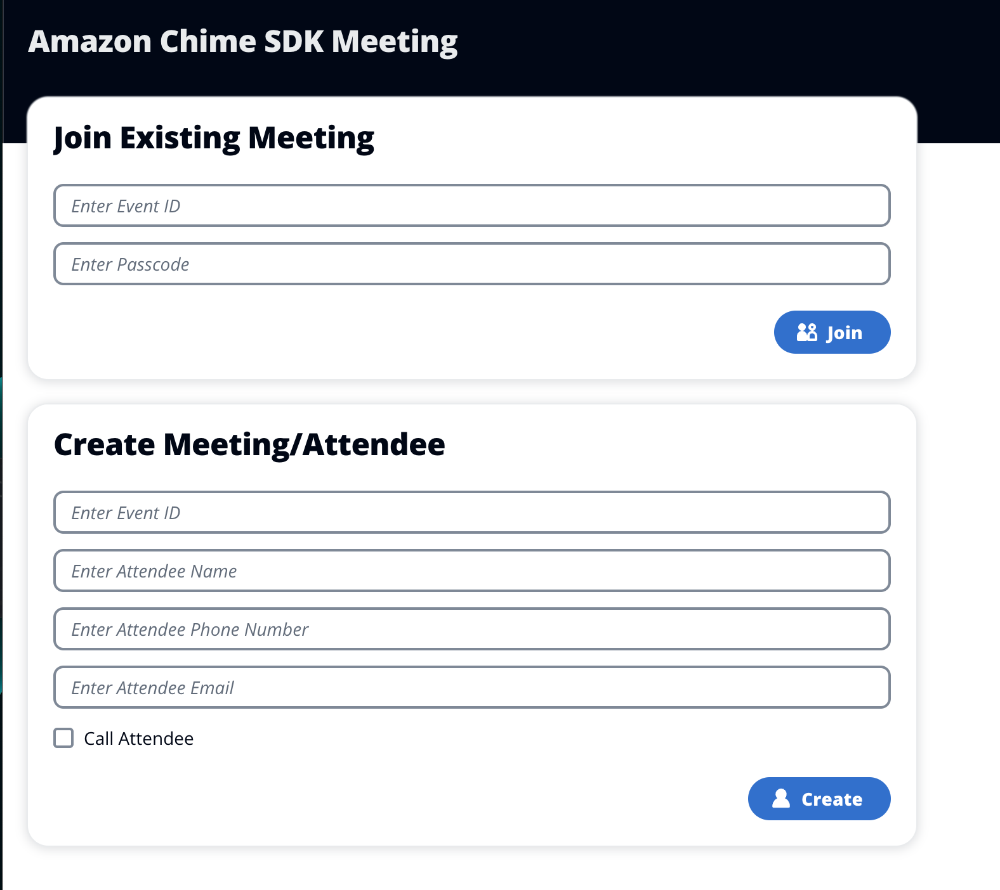

# Amazon Chime SDK SMA Meeting Dialer

This demo combines several different components to produce an application that will create a multi-mode Amazon Chime SDK Meeting. Participants can be created either by uploading a file to an Amazon Simple Storage Service (S3) bucket or through a web page. The participants of this meeting will be sent an email with meeting details and optionally called directly. Participants to this meeting have the option of joining by phone or by WebRTC client.

## Requirements

- AWS Account
- Deployed to `us-east-1`
- Docker installed and running
- Good understanding of Python

## Creating a Meeting

This demo deploys two methods for creating an Amazon Chime SDK Meeting


In both cases, the [createMeeting/index.py](src/resources/createMeeting/index.py) AWS Lambda function is being invoked to handle the Amazon Chime SDK Meeting creation.

This function will look through the request for the requested participants and create a list of attendees using the supplied phone number as the `ExternalUserId`:

```python
    for participant in participants:
        logger.info('Adding attendee %s', participant['PhoneNumber'])
        participant_list.append({
            "Name":  participant.get('Name', 'None'),
            "PhoneNumber": participant['PhoneNumber'],
            'Email':  participant.get('Email', 'None'),
            'CallParticipant': participant.get('CallParticipant', 'None')})
        attendee_list.append({
            'ExternalUserId': participant['PhoneNumber'],
        })
```

With this `attendee_list`, a request is made to `create_meeting_with_attendees`:

```python
        meeting_info = chime_sdk_meeting_client.create_meeting_with_attendees(
            ClientRequestToken=str(event_id),
            MediaRegion='us-east-1',
            ExternalMeetingId=str(event_id),
            Attendees=attendee_list
        )
```

Once the meeting and attendees have been created, a six digit `meeting_passcode` is created for each participant and this information is loaded into the `meeting_table` and notifications are sent:

```python
        for attendee in participant_list:
            meeting_passcode = randint(100000, 999999)
            meeting_object = {
                'EventId': str(event_id),
                'MeetingPasscode': str(meeting_passcode),
                'PhoneNumber':  attendee['PhoneNumber'],
                'Name': attendee['Name'],
                'TTL':  int(time.time() + 86400)
            }
            logger.info('Meeting Object: %s', json.dumps(meeting_object, cls=DecimalEncoder))
            meeting_table.put_item(Item=meeting_object)
            if (attendee['Email'] != 'None' and FROM_EMAIL != ''):
                logger.info('Sending email to %s for meeting %s', attendee['Email'], meeting_object['EventId'])
                send_email(event_id, attendee['Email'], meeting_passcode)
            if attendee['CallParticipant'] is True:
                logger.info('Calling attendee at %s for meeting %s', attendee['PhoneNumber'], event_id)
                call_participant(attendee, event_id, meeting_passcode)
```

If a `FROM_EMAIL` address has been provided and [configured](#ses-configuration) in Amazon Simple Email Service (SES), an email will be sent to participants. If `CallParticipant` is selected, that participant will be called. Both notification methods are optional.

### Uploading JSON file

To create a meeting via file upload, copy a JSON file to the S3 bucket to begin the process ([trigger.json](/trigger.json) provided as an example). The json file should be formatted as:

```json
{
  "EventId": 123456,
  "Participants": [
    {
      "Name": "Nikki",
      "PhoneNumber": "+13125551212",
      "Email": "nikki@example.com",
      "CallParticipant": true
    },
    {
      "Name": "Jane",
      "PhoneNumber": "+14025551212",
      "Email": "jane@example.com",
      "CallParticipant": false
    }
  ]
}
```

When uploaded to the included S3 bucket, the `createMeeting` AWS Lambda function will be invoked and read the JSON file.

### Creating Manually via Web Page



Alternatively, the web site included can be used to create a meeting for one participant. This site (accessed either locally or through the Amazon CloudFront distribution) uses an Amazon API Gateway to invoked the `createMeeting` AWS Lambda function.

## Joining a Meeting

This demo provides three ways of joining a meeting:

- Outbound Call
- Inbound Call
- WebRTC

All three of these methods can be used by different participants in the same meeting.


### Outbound Call

As part of the `createMeeting` AWS Lambda function, if `CallParticipant` is marked as `True`, `create_sip_media_application` will be used to call the participant. This request will include information about the participant that is passed in the `ArgumentsMap` to the Amazon Chime SDK SIP media application.

```python
def call_participant(attendee, event_id, meeting_passcode):
    try:
        chime_sdk_voice_client.create_sip_media_application_call(
            FromPhoneNumber=FROM_NUMBER,
            ToPhoneNumber=attendee['PhoneNumber'],
            SipMediaApplicationId=SIP_MEDIA_APPLICATION_ID,
            ArgumentsMap={
                'meeting_id': attendee['MeetingId'],
                'attendee_id': attendee['Attendee']['AttendeeId'],
                'join_token': attendee['Attendee']['JoinToken'],
                'event_id': str(event_id),
                'meeting_passcode': str(meeting_passcode),
                'phone_number': attendee['PhoneNumber'],
            }
        )
    except Exception as error:
        logger.error('Error calling attendee: %s', error)
        raise error
```

Within the [SIP media application handler](src/resources/smaHandler/index.py), two invocation events will occur:

```python
    elif event_type == 'NEW_OUTBOUND_CALL':
        logger.info('Adding transaction attributes')
        transaction_attributes['meeting_id'] = event['ActionData']['Parameters']['Arguments']['meeting_id']
        transaction_attributes['attendee_id'] = event['ActionData']['Parameters']['Arguments']['attendee_id']
        transaction_attributes['join_token'] = event['ActionData']['Parameters']['Arguments']['join_token']
        transaction_attributes['event_id'] = event['ActionData']['Parameters']['Arguments']['event_id']
        transaction_attributes['meeting_passcode'] = event['ActionData']['Parameters']['Arguments']['meeting_passcode']
        transaction_attributes['phone_number'] = event['ActionData']['Parameters']['Arguments']['phone_number']
        transaction_attributes['call_type'] = 'outbound'
        return response(transaction_attributes=transaction_attributes)
    elif event_type == 'CALL_ANSWERED':
        return response(outbound_call_speak_and_get_digits_action(transaction_attributes), transaction_attributes=transaction_attributes)
```

During the `NEW_OUTBOUND_CALL`, the information in the `ArgumentsMap` will be stored as transaction attributes within the SIP media application. An addition attribute of `call_type` is created noting the direction of the call. These attributes will be used in subsequent invocations. When the participant answers the call, the `CALL_ANSWERED` invocation event type will be triggered and the participant will be asked to press `1` to join the meeting:

```python
def outbound_call_speak_and_get_digits_action(transaction_attributes):
    return {
        "Type": "SpeakAndGetDigits",
        "Parameters": {
            "MinNumberOfDigits": 1,
            "MaxNumberOfDigits": 1,
            "Repeat": 3,
            "RepeatDurationInMilliseconds": 3000,
            "InputDigitsRegex": "[1-2]",
            "InBetweenDigitsDurationInMilliseconds": 1000,
            "TerminatorDigits": ["#"],
            "SpeechParameters": {
                "Text": "<speak>You are needed on a call for event <say-as interpret-as='digits'>" +
                transaction_attributes['event_id'] +
                "</say-as>. Press 1 to join, 2 to decline.</speak>",
                "Engine": "neural",
                "LanguageCode": "en-US",
                "TextType": "ssml",
                "VoiceId": "Joanna"},
            "FailureSpeechParameters": {
                "Text": "Sorry, I didn't get that.  Please press 1 to join, 2 to decline.",
                "Engine": "neural",
                "LanguageCode": "en-US",
                "TextType": "text",
                "VoiceId": "Joanna"},
        },
    }
```

### Inbound Call

The participant can also join the meeting by calling in to the Amazon Chime SDK SIP media application. In this case, a passcode must be used to join the meeting. This passcode will be emailed to the participant as part of the notification in the `createMeeting` function.

```python
    if event_type == 'NEW_INBOUND_CALL':
        transaction_attributes['call_type'] = 'inbound'
        return response(inbound_call_speak_and_get_digits_action("<speak>Please enter your 6 digit event i d</speak>"), transaction_attributes=transaction_attributes)
```

When the Amazon Chime SDK SIP media application answers the call, it will prompt to caller to enter the six digit event ID that was used to create the meeting. When the user enters a six digit event, the Amazon Chime SDK SIP media application will be invoked with an event type of `ACTION_SUCCESSFUL` with ActionData of `SpeakAndGetDigits`:

```python
    elif event_type == 'ACTION_SUCCESSFUL':
        if event['ActionData']['Type'] == 'SpeakAndGetDigits':
...
            elif transaction_attributes['call_type'] == 'inbound':
                received_digits = event['ActionData']['ReceivedDigits']
                if 'event_id' not in transaction_attributes:
                    transaction_attributes['event_id'] = received_digits
                    return response(
                        inbound_call_speak_and_get_digits_action("<speak>Please enter your 6 digit passcode to join the meeting.</speak>"),
                        transaction_attributes=transaction_attributes)
                else:
                    try:
                        event_info = meeting_table.get_item(Key={"EventId": transaction_attributes['event_id'], 'MeetingPasscode': received_digits})
                        logger.info('Meeting info: %s', json.dumps(event_info,  cls=DecimalEncoder, indent=4))
                    except Exception as error:
                        logger.error('Error getting meeting info from DynamoDB: %s', error)
                        raise error
                    if event_info.get('Item'):
                        transaction_attributes['phone_number'] = event_info['Item']['PhoneNumber']
                        transaction_attributes['event_id'] = str(event_info['Item']['EventId'])
                        transaction_attributes['meeting_passcode'] = received_digits
                        meeting_info = create_meeting(transaction_attributes)
                        transaction_attributes['meeting_id'] = meeting_info['Meeting']['MeetingId']
                        transaction_attributes['attendee_id'] = meeting_info['Attendees'][0]['AttendeeId']
                        transaction_attributes['join_token'] = meeting_info['Attendees'][0]['JoinToken']
                        return response(join_chime_meeting_action(call_id, transaction_attributes), transaction_attributes=transaction_attributes)
                    else:
                        return response(speak_action(call_id, "Invalid meeting passcode."), hangup_action(call_id), transaction_attributes=transaction_attributes)
```

During an inbound call, the first request will be to capture the `event_id`. If this does not exist, the received digits will be stored as a transaction attribute. During the second request, using the stored `event_id` and the newly captured digits, a request will be made to the Amazon DynamoDB to see if this combination of `event_id` and `meeting_passcode` exist. If they do exist, these attributes will be stored as transaction attributes and the caller will be joined to the meeting. If they do not exist, the caller will be told the passcode is invalid and the call will be hung up.

### WebRTC

The third method of joining the meeting is via WebRTC on a site created using [amazon-chime-sdk-component-library-react](https://github.com/aws/amazon-chime-sdk-component-library-react).

This meeting can be joined directly through the emailed link, or through the included site.


The url required to join directly will include both `eventId` and `passcode` as URL query parameters as shown here.


## Deployment

### Components Created

- Amazon Chime PSTN phone number
- Amazon Chime SIP media application
- Amazon Chime SIP media application rule
- AWS Lambda Functions
  - [cognitoDomain](src/resources/cognitoDomain/domainValidator.js)
  - [createMeeting](src/resources/createMeeting/index.py)
  - [endMeeting](src/resources/endMeeting/index.py)
  - [joinMeeting](src/resources/joinMeeting/index.py)
  - [queryMeeting](src/resources/queryMeeting/index.py)
  - [smaHandler](src/resources/smaHandler/index.py)
- Amazon API Gateway
- Amazon DynamoDB Table
- Amazon Cognito UserPool
- Amazon S3 Buckets
  - Upload bucket
  - Site bucket
- Amazon CloudFront Distribution

To deploy the Amazon Cloud Development Kit (CDK):

`yarn launch`

### Environment Variables

Additional configuration can be provided by exporting variables that are used by the CDK.

```
export FROM_EMAIL="test@exmaple.com"
export ALLOWED_DOMAIN="example.com"
```

These variables will be passed to the CDK and used to configure the application.

The `ALLOWED_DOMAIN` is used as part of the Amazon Cognito sign up process and will restrict access to email addresses that use the provided domain. If no domain is provided for `ALLOWED_DOMAIN`, all valid email addresses will be accepted.

### SES Configuration

`FROM_EMAIL` is used to configure SES to allow emails to be sent out. This demo will use the [SES sandbox](https://docs.aws.amazon.com/ses/latest/dg/request-production-access.html) and does not require production access. However, this does require you to verify the TO and FROM email addresses. More information on using SES is available [here](https://docs.aws.amazon.com/ses/latest/dg/verify-addresses-and-domains.html).

## Cleanup

To remove this demo from your account:

```
yarn cdk destroy
```
